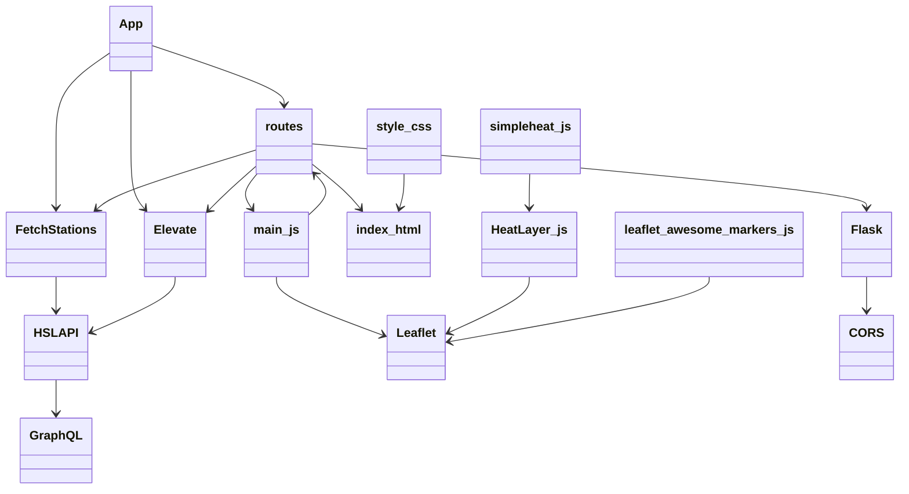
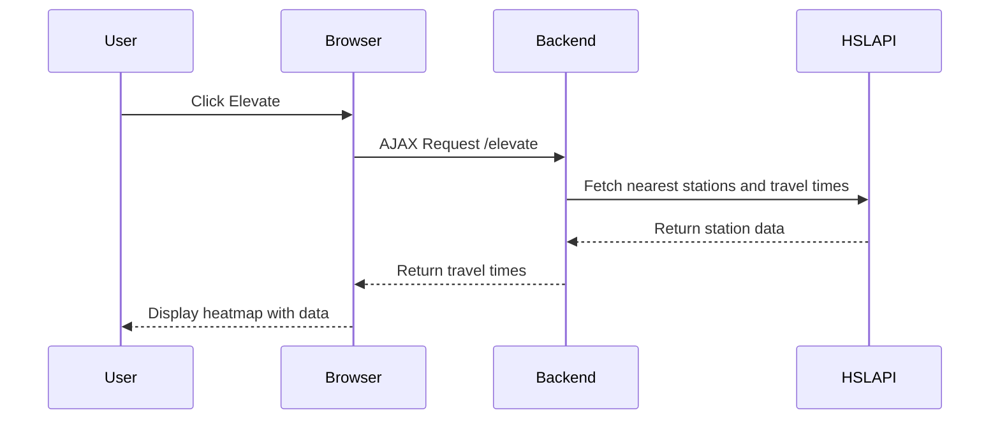

# ElevateR Application Documentation

## Overview

**ElevateR** is a web application that visualizes public transportation stations in Helsinki and provides users with the ability to interact with a map, select a station, and "elevate" it to display travel times from the selected station to nearby stations using a heatmap. It integrates with the Helsinki Region Transport (HSL) API to fetch data related to stations and itineraries.

The application has both a backend, written in Python using Flask, and a frontend using HTML, CSS, and JavaScript with Leaflet for map rendering and data visualization.

## Features

1. **Map Visualization**:
   - Display a map of Helsinki Metropolitan area using Leaflet.
   - Cluster and display markers for public transport stations.
   - Different colors and icons represent different types of transport (bus, tram, train, metro, ferry).

2. **Station Selection**:
   - Users can click on a station marker to select it. The selected marker changes color to indicate selection.
   - The name of the selected station is displayed in an input field.

3. **Elevation Feature**:
   - After selecting a station, the user can press an "Elevate" button.
   - This triggers a backend process that fetches travel times between the selected station and the nearest 100 stations.
   - A heatmap is generated, color-coded based on travel time from the selected station to nearby stations.

4. **Heatmap Generation**:
   - The heatmap uses color gradients to represent the travel time. Green represents the shortest travel time, while red represents the longest.

## Application Structure

```plaintext
ElevateR/
├── backend/
│   ├── fetch_stations.py                       # Fetches stations from the HSL API
│   ├── elevate.py                              # Handles the elevation logic and travel time queries
│   └── routes.py                               # Defines routes for handling requests
├── frontend/
│   ├── static/
│   │   ├── js/
│   │   │   ├── main.js                         # Main logic for map rendering and interactions
│   │   │   ├── HeatLayer.js                    # Customized Leaflet heatmap layer
│   │   │   ├── leaflet.awesome-markers.js      # Marker customization plugin
│   │   │   └── simpleheat.js                   # Customized Heatmap library for rendering
│   │   ├── styles/
│   │   │   ├── style.css                       # Styling for the map, button, and layout
│   │   │   └── leaflet.awesome-markers.css     # Custom marker styles
│   └── templates/
│       └── index.html                          # Main HTML file for rendering the map
└── app.py                                      # Flask application entry point
```

## Backend Components

### `fetch_stations.py`
- Connects to the HSL API using GraphQL and retrieves all stations within a specific bounding box around Helsinki.
- Each station has details like name, latitude, longitude, and vehicle type.

### `elevate.py`
- Defines the logic for finding the nearest 100 stations to a selected station.
- Uses HSL's itinerary planning API to calculate travel times from the selected station to the others.
- Returns data formatted for the frontend to generate a heatmap.

### `routes.py`
- Defines Flask routes:
  - `/`: Renders the main page (`index.html`).
  - `/elevate`: Receives a selected station’s latitude and longitude, calls the `elevate` function, and returns travel time data for nearby stations.


## Frontend Components

### `index.html`
- Defines the structure of the web page, including the map container, selected bus stop display, and the "Elevate" button.
- Integrates with Leaflet for map rendering and uses external CSS and JavaScript for markers and heatmaps.

### `main.js`
- Initializes the Leaflet map, sets up clustering for stations, and handles user interactions (such as selecting a station and triggering the elevation process).
- Sends an AJAX request to the backend when the user clicks the "Elevate" button.

### `HeatLayer.js`
- Custom implementation of a Leaflet heatmap layer that generates heatmaps based on travel time data.
- Works in conjunction with `simpleheat.js` to render dynamic heatmap data.

### `simpleheat.js`
- Customized for this application to support heatmap generation based on travel time.
- Implements an efficient rendering of heatmap data using points on the map, supports dynamic radius, gradient control, and opacity.
- Checks for overlapping points and prevents them from being rendered, ensuring clear visualization of the heatmap.

### `leaflet.awesome-markers.js`
- A plugin that adds custom icons and colors to Leaflet markers based on the type of transport (bus, tram, train, etc.).

### `style.css`
- Contains the styling for the map container, button, and overall layout of the page.
- Includes custom keyframe animations for the "Elevate" button to add visual feedback when hovered.


## Key Functions and Workflows

### Station Fetching (Backend)

#### `fetch_helsinki_stations` (in `fetch_stations.py`):
- Sends a GraphQL request to the HSL API.
- Fetches a list of public transport stations within a predefined bounding box around Helsinki.


### Elevation Process (Backend)

#### `elevate` (in `elevate.py`):
- Takes the latitude and longitude of the selected station and finds the nearest 100 stations using the Haversine formula.
- Sends a batch GraphQL query to the HSL API to calculate travel times between the selected station and nearby stations.
- Returns a list of stations with travel times to the frontend.


### Map Rendering and User Interaction (Frontend)

#### Map Initialization (`main.js`):
- Initializes a Leaflet map and adds stations as markers, clustered for better visualization.
- Each marker is clickable, allowing the user to select a station.

#### Marker Customization (`leaflet.awesome-markers.js`):
- Customizes marker colors and icons based on the type of transport.

#### Heatmap Generation (`HeatLayer.js` and `simpleheat.js`):
- Once travel time data is received from the backend, a heatmap is generated on the map using the heat layer.
- `simpleheat.js` is responsible for efficiently rendering heatmaps based on the data, adjusting colors, gradients, and ensuring non-overlapping points.


## Future Improvements

### Error Handling
- Improve error handling in case of issues fetching data from the HSL API, providing the user with clear feedback and fallback mechanisms.

### Caching
- Implement caching for station data to reduce the number of API calls and improve performance, especially for frequently used stations.

### Optimization
- Further optimize the frontend for better performance, especially when dealing with large datasets and heatmap rendering.
- Refactor `main.js` into smaller, modular JavaScript files to improve code maintainability and scalability.

### Dropdown Menu for Transport Selection
- Add a dropdown menu allowing the end-user to select which modes of transportation (bus, tram, train, etc.) they want to display on the map.

### Accessibility Enhancements
- Add a feature allowing users to customize map colors with alternative color schemes that enhance contrast, specifically for users with color vision deficiency. Currently, the app uses a green-red scheme, chosen over the original blue-red because it provides a better visual experience. However, due to time constraints, a dropdown menu for selecting color schemes has not yet been implemented.

### Additional Dropdown Menu Options
- **Show/Hide Markers**: Add an option to toggle the visibility of station markers based on different vehicle types or zoom levels.
- **Route Preferences**: Include options to prefer certain types of transportation modes, such as fastest routes, shortest routes, or routes with fewer transfers.
- **Theme Customization**: Let users choose different themes (e.g., light mode, dark mode) for the overall map display and UI.
- **Dynamic Heatmap Expansion**: Allow users to download initial data and continuously request additional information in the background, progressively expanding the heatmap by increasing the radius. This would result in a larger heatmap that updates dynamically over time.

## Class Diagram


## Simple Sequence Diagram Illustrating the Basic Functionality
